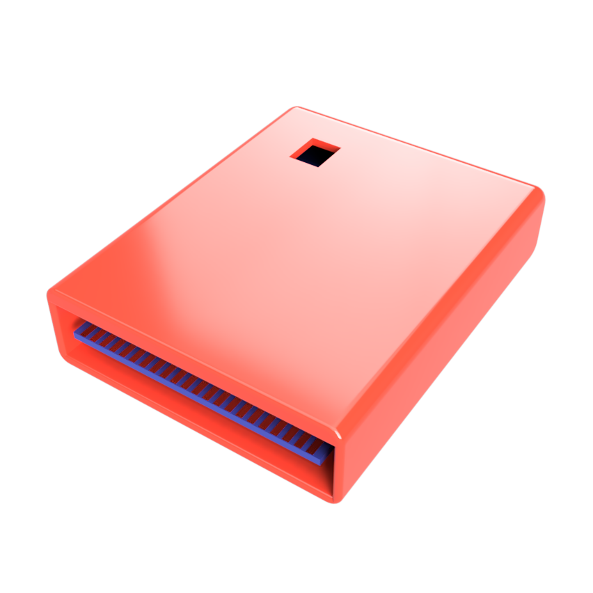

# Retro Ninja Quad Ultimax Cartridge

Eagle schematics and board for a C64 Ultimax cartridge with two-bit ROM selector DIP switch (or jumpers). It's based on a 27256 type EPROM and can fit four 64Kbit (8KB) Ultimax ROM images.

Combine up to four 8KB ROM files into one bigger file before burning EPROM.

 

The DIP switch is optional. Leave it out if all you need is one 8KB ROM. The DIP switch can also be replaced by a couple of jumpers.

Gerber files and 3D-printable enclosure included.

## BOM
 |Component|Pcs |Comment|
 |:--------|---:|:------|
 | 27256/27C256 EPROM DIP-28| 1 | or compatible EPROM|
 | 2-pos dip switch | 1 | Optional. CT2062-ND from Digikey or similar| 
 | 100nF ceramic capactitor | 1 | |
 | 10k resistor | 2 | |
 
